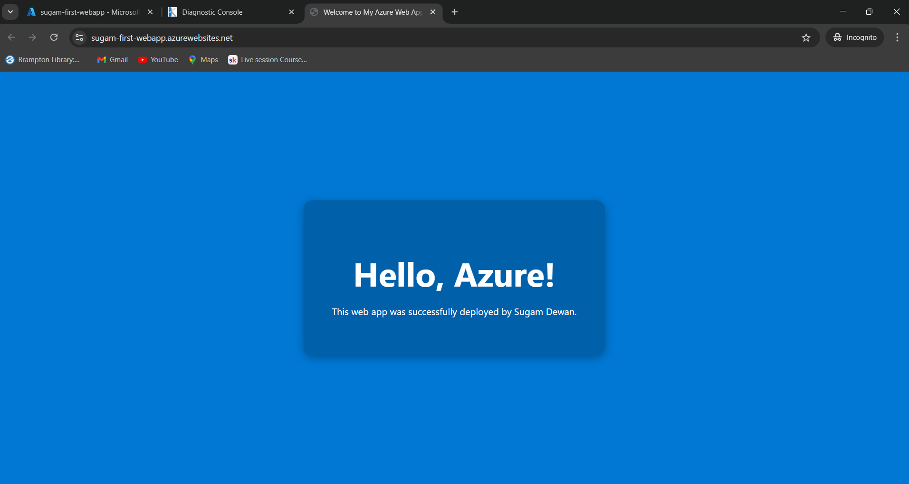

# Azure Web App Deployment Demo

## Objective

This repository documents a foundational cloud project: deploying a static web application to Microsoft Azure. The primary objective was to provision a cloud hosting environment and deploy code to it, showcasing a practical understanding of Azure's Platform-as-a-Service (PaaS) offerings.

This project was built within a temporary, sandboxed Azure environment, so a live demo is not available. The focus is on the process and the proof of successful deployment.

## Technologies Used

* Microsoft Azure
* Azure App Service
* Kudu (App Service Deployment Engine)
* HTML

## Project Process

The deployment was completed in three main steps:

1.  **Local Application Creation:** A simple `index.html` file was created locally to serve as the application code.

2.  **Provisioning Azure Resources:** Using the Azure Portal, a new Azure App Service and its corresponding App Service Plan were created and configured. This served as the cloud-based hosting environment for the web application.

3.  **Code Deployment:** The `index.html` file was uploaded directly to the App Service's `wwwroot` directory using the Kudu Advanced Tools, which provides direct access to the web server's file system.

## Deployment Success Verification

The web application was successfully deployed and is accessible via a public URL provided by the App Service. The screenshot below shows the live site before the temporary sandbox environment expired.

## Key Learnings

* Hands-on experience with provisioning and configuring **Azure App Service**, a core PaaS offering for web hosting.
* Practical understanding of the deployment process for web applications in Azure, specifically using the **Kudu service** to manage files in the `wwwroot` directory.
* Encountered and resolved a real-world deployment issue related to **Azure Policy**, learning how to adapt to environment-specific restrictions (e.g., region limitations) by selecting an allowed deployment location.
